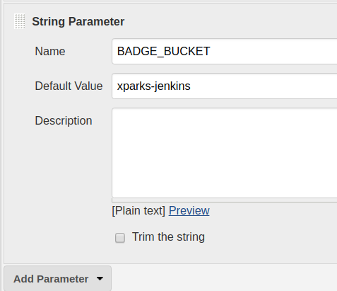

# AUniter Badge Service

## Introduction

[Continuous Integration with Jenkins](../jenkins/README.md) explains that
AUniter can be used by a locally hosted instance of
[Jenkins](https://jenkins.io). It has become popular to display
the current status of the continuous integration using
[GitHub badges](https://tygertec.com/add-badges-github-project/).

If the continuous integration service was running in the cloud
and publically accessible (e.g.
[Travis](https://travis-ci.org),
[CircleCI](https://circleci.com)),
and integrated with
[shields.io](https://github.com/badges/shields),
you could just add a simple shields.io URL into your README.md file to embed the
badge. Shields.io knows how to query the status of a number of Continuous
Integration services, and extract the correct information. However, our Jenkins
server runs on a local host, behind a firewall, so shields.io cannot reach it.

If GitHub had a mechanism to hold a small bit of user-defined parameter, and if
it had a way to dynamically generate a URL into the README.md based on the
user-defined parameter, we could let the GitHub markdown generator to generate
this badge for us. But as far as I can tell, GitHub does not provide such
functionality.

## A Badge Service

The **BadgeService** is a micro web server using
[Google Cloud Functions](https://cloud.google.com/functions/) whose
sole job is to return a badge that reflects the state of a build of a given
project. The state of the build is stored as zero-length files on
[Google Cloud Storage](https://cloud.google.com/storage/)
(Google's file system in the cloud). These files can be created and
modified by a shell script (`set-badge-status.sh`) which can be called from a
[Jenkinsfile](https://jenkins.io/doc/book/pipeline/jenkinsfile/)
by the locall hosted Jenkins server.

An example might make this more clear.
For the [AceSegment](https://github.com/bxparks/AceSegment) project,
I created a **BadgeService** at
https://us-central1-xparks2018.cloudfunctions.net/badge?project=AceSegment.
This microservice looks for two files in Google Cloud Storage:
* `gs://xparks-jenkins/AceSegment=PASSED`, or
* `gs://xparks-jenkins/AceSegment=FAILED`.

If it finds a file named `AceSegment=PASSED`, the **BadgeService** returns
a green "passing" badge from shields.io. If it detects a file named
`AceSegment=FAILED`, it returns a red "failure" badge from shields.io.

Prior to v1.4, **BadgeService** fetched the images from shields.io at serving
time, then proxied the image to the original requester. This had 2
problems:
1. It increased the latency of the request since the image was fetched at
   serving time,
1. It made shields.io a point of failure of the service.

After v1.4, the service uses statically-compiled copies of various badge images
from shields.io. The badges are only about 500 bytes each, and we use only 5 of
them, so the images are compiled directly into the JavaScript/NodeJS code.

## Architecture Diagram

Here's a dependency diagram which might make this more clear:
```
                  Google Cloud
                    Storage
                     ^    ^
                    /      \
                   /        \
                  |          \
                  |       Google Functions
                  |       BadgeService (statically cached images)
                  |             ^
        firewall  |             |
=========================       | (GET badge image)
                  |             |
                  |             |
  (create/remove  |             |
   marker files)  |         GitHub/README.md
                  |             ^
     set-badge-status.sh        |
                  ^             |
                  |             |
Arduino board     |             | (GET)
        ^         |             |
         \        |             |
    auniter.sh    |             |
           ^      |             |
            \     |             |
         local Jenkins        user/browser
           service
```

Since shields.io cannot contact the local Jenkins serice, and neither can the
**BadgeService**, we use Google Cloud Storage as an intermediary to store the
state of the build.

## Setup Instructions

### Setup Badge Service

1. Download and install [Google Cloud SDK](https://cloud.google.com/sdk/).
1. Create a Google Cloud Platform (GCP) project.
   See the [Cloud Functions - Cloud Storage Tutorial](https://cloud.google.com/functions/docs/tutorials/storage)
   for example.
    * Enable billing.
    * Add Google Cloud Functions API.
1. Install `gsutil` for user `jenkins` in its home directory.
    * `$ sudo -i -u jenkins`
    * (You will be in `/var/lib/jenkins` on Ubuntu Linux.
    * Install [Standalone gsutil](https://cloud.google.com/storage/docs/gsutil_install)
1. Authenticate using OAuth2.
    * Verify that you are still user `jenkins`.
    * `$ sudo -i -u jenkins`
    * `jenkins$ gsutil config`
    * Go the the URL displayed by the script and follow the instructions.
1. Create Google Cloud Storage bucket
    * Go to the [Google Cloud Console](https://console.cloud.google.com).
    * Go to the [Google Cloud Storage Browser](https://console.cloud.google.com/storage/browser).
    * Click on the `Create Bucket` link.
    * Create a `{bucketName}`. Google Storage bucket names must be globally
      unique (all buckets live in a global namespace).
    * I chose something like `xparks-jenkins` as my bucket name. My project is
      called `xparks` (which is unique), so I added the `-jenkins` suffix after
      it.
1. Git clone the **AUniter** project.
    * `$ git clone https://github.com/bxparks/AUniter`
1. Configure the **BadgeService**.
    * `$ cd AUniter/BadgeService`
    * Edit `index.js`.
    * Change the value of `bucketName` in `index.js` with the `{bucketName}`
      that you selected above.
    * The `package.json` file should not need to be changed.
1. Upload the `index.js` script to Google Cloud Functions, giving it the
   name `badge`:
    * `$ gcloud functions deploy badge --trigger-http`
    * Take note of the trigger URL that is printed.
    * It will needed below where you will replace `{badgeServiceUrl}` with this
    * URL.
    * The URL will will look something like
      https://us-central1-xparks2018.cloudfunctions.net/badge.
1. Test the badge for a project that passes the continuous integration.
    * Create `gs://{bucketName}/test=PASSED` using the `set-badge-status.sh`
      script.
        * `$ ./set-badge-script.sh {bucketName} test PASSED`
    * Goto https://{badgeServiceUrl}?project=test
    * Verify that you see a green badge.
1. Test the badge for a failing project.
    * Create `gs://{bucketName}/test=FAILED`.
        * `$ ./set-badge-script.sh {bucketName} test FAILED`
    * Goto https://{badgeServiceUrl}?project=test.
    * Verify that you see a red badge.
1. Insert `

### Setup the Jenkinsfile

The Jenkinsfile needs an additional `post` section, right after the `stages`
section, so that it can call the `set-badge-status.sh` script at the end of a
continuous integration iteration to notify Google Cloud Storage whether the
project passed or failed. (See
[Inside the Jenkinsfile](../jenkins/README.md)
for a description of the Jenkinsfile used by AUniter). The file now looks like
this:

```
pipeline {
    agent { label 'master' }
    stages {
        stage('Setup') {
            ...
        }
        ...
    }
    post {
        failure {
            script {
                if (env.BADGE_BUCKET?.trim()) {
                    sh "AUniter/BadgeService/set-badge-status.sh \
                        $BADGE_BUCKET {project} FAILED"
                }
            }
        }
        success {
            script {
                if (env.BADGE_BUCKET?.trim()) {
                    sh "AUniter/BadgeService/set-badge-status.sh \
                        $BADGE_BUCKET {project} PASSED"
                }
            }
        }
    }
}
```

The `{project}` in the above should be replaced by the name of your
project.

### Configure the Jenkins Pipeline

The Jenkinsfile needs to be told the name of the Google Cloud Storage
bucket (`{bucketName}`) that will be used to hold the zero-length
files which indicate the status of the build. I opted to use a Jenkins
build parameter that can be set through the web configuration UI:

Add `BADGE_BUCKET` build parameter:
* Click on `{Name of Pipeline} > Configure > This project is parmeterized`
* Select `Add Parameter > String Parameter`
* Add `BADGE_BUCKET`: {bucketName}` where {bucketName} is the name of your
  bucket that you created above.
* Click the `Save` button.



### Verification

After running the Jenkins pipeline for your project, perform the
following verification:

* There should be a zero-length file at gs://{bucketName}/{project}=PASSED
  or gs://{bucketName}/{project}=FAILED.
* From your web browser, go to
  `https://{badgeServiceUrl}/badge?project={project}`.
* You should see either a green (passed) or a red (failed) badge.

Finally, add the image Markdown tag into the README.md file of your
project pointing to the {badgeServiceUrl}.

### GitHub Caching

Even though the badge image is returned with a header that disables caching of
the image:
```
Cache-Control: no-cache, no-store, must-revalidate
```
GitHub will ignore that setting and cache the badge image anyway. Fortunately,
the cache time period seems to be relatively short (a few hours?).

## Security, Privacy and Scalability

* The Google Cloud Storage bucket does *not* need to be publically accessible.
    * The **BadgeService** runs with your credentials so it is able to access
      the GCS bucket.
    * The `set-badge-status.sh` called by Jenkins uses the `gsutil` command
      which uses the OAuth2 tokens that were given to it through the
      `gsutil config` authentication process described above.
* The badge URL takes a `project` parameter which can be given an arbitrary
  value by anyone, which allows them to determine the existence of certain files
  in that bucket (i.e files named `{project}=PASSED` or `{project}=FAILED`).
    * However, this GCS bucket is *only* used for maintaining
      the status information of continuous integrations, so this leakage of
      information has no consequences.
* Queries to the Google Cloud Storage are relatively expensive.
    * To mitigate this overhead, the **BadgeService** Function caches the
      result for one minute.
    * Multiple calls to the same Function, on the same computing instance, cause
      no additional queries to the Google Cloud Storage within that one minute
      caching period. Each new computing instance will need to warm up its
      cache, so will cause a query to Google Cloud Storage.
* It is not entirely clear what will happen if someone launches a
  denial-of-service attack on BadgeService URL.
    * Google Functions will automatically expand the number of computing
      instances to handle the load.
    * However, at some point, the system will hit various
      [quotas and rate limits](https://cloud.google.com/functions/quotas).

## Pricing

For projects with small amounts of traffic to the GitHub README.md page, we can
depend on the [free tier](https://cloud.google.com/functions/pricing) which
provides for the following resources free per month:
* 2 million invocations
* 400,000 GB-seconds of CPU time
* 200,000 GHz-seconds of CPU performance (clock frequency)
* and 5GB of Internet egress traffic
