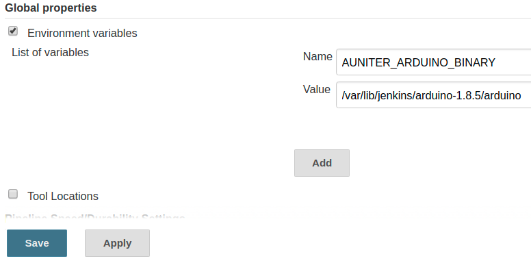
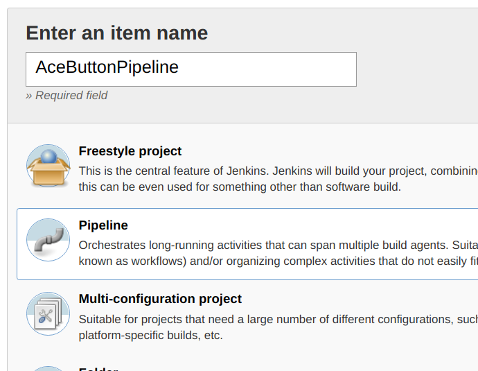
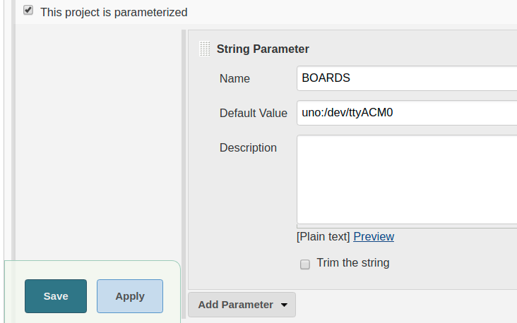
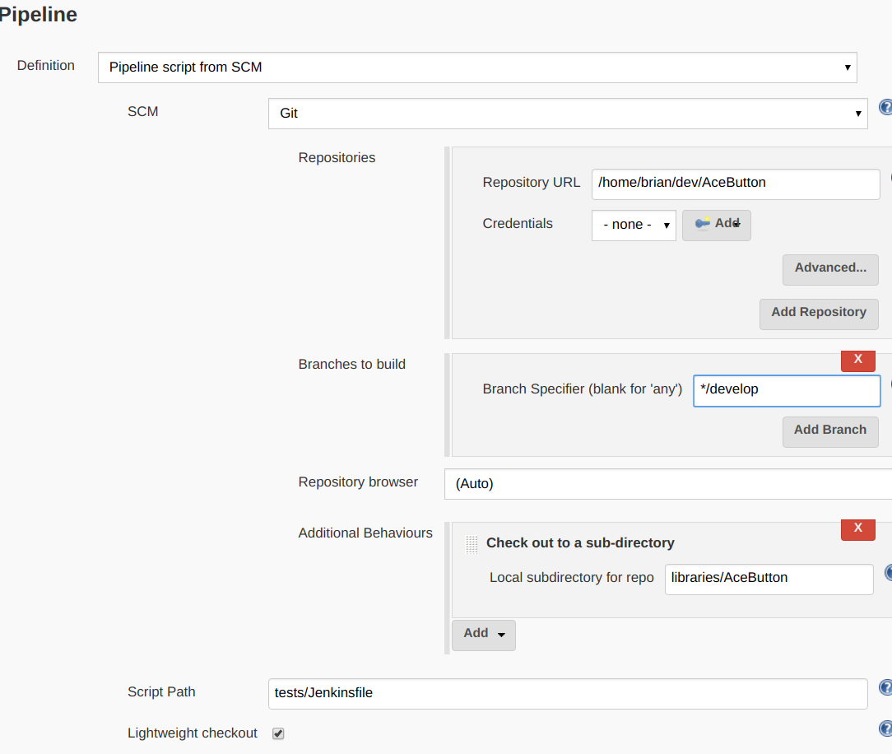
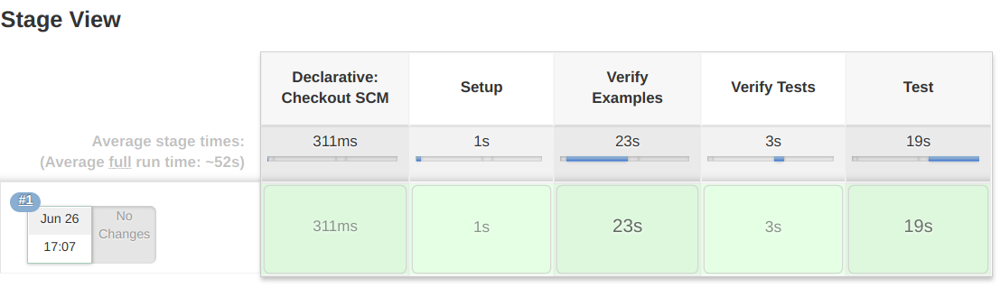
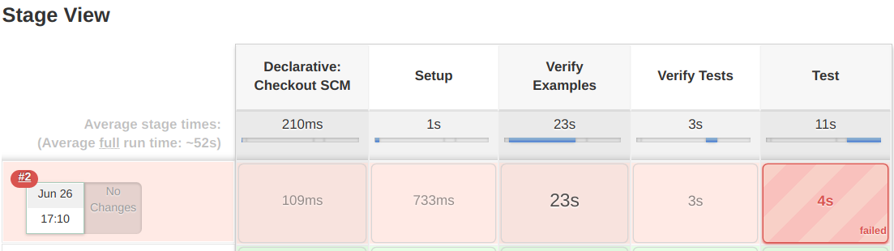
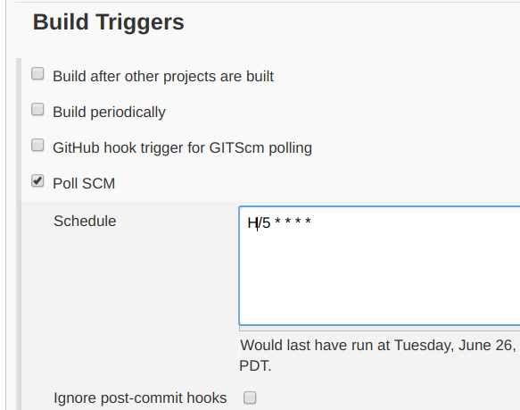

# AUniter Integration with Jenkins

[Jenkins](https://jenkins.io) is a software automation tool for continuous
integration (CI) and continous deployment (CD). It has a master/slave
architecture with the master handing off jobs to worker slaves. In a small
configuration, the master can run on the local machine with no slaves and
execute all jobs by itself.

The [AUniter](https://github.com/bxparks/AUniter) scripts can be configured to
run from Jenkins so that the Arduino command line runs periodically (or upon
source code change) and the results will be tracked by Jenkins and displayed on
the Jenkins dashboard.

If unit tests are written in
[AUnit](https://github.com/bxparks/AUnit) and an Arduino board is connected to
the local machine, the `auniter.sh` can upload the unit test to the board,
and monitor the serial port to determine if the test passed or failed,
and the results can be tracked on the Jenkins dashboard.

## Installation

The following installation instructions are known to work on:

* Ubuntu 16.04
* Ubuntu 17.10
* Ubuntu 18.04 (minimal desktop install)
* Xubuntu 18.04 (minimal desktop install)

Other Linux installations may also work but I have not verified them.

### Prerequisite

Jenkins is Java app that requires the Java runtime to be installed. Only
Java 8 is supported. (The Arduino IDE is also a Java app, but it seems to be
bundled with its own Java runtime engine, so doesn't require additional
packages.)

Install the Open JDK 8 runtime:
```
$ sudo apt install openjdk-8-jdk
```
(It might be possible to just install `openjdk-8-jre` but I have not verified
this.)

### Install Jenkins

Jenkins can be run as a Docker service, or as a normal Linux service.
For the integration with `AUniter` and the Arduino IDE, we will run
it as a normal Linux service.

Follow the
[Jenkins install instructions](https://jenkins.io/doc/book/installing/#debian-ubuntu):
```
$ wget -q -O - https://pkg.jenkins.io/debian/jenkins.io.key | sudo apt-key add -
$ sudo sh -c 'echo deb http://pkg.jenkins.io/debian-stable binary/ > /etc/apt/sources.list.d/jenkins.list'
$ sudo apt update
$ sudo apt install jenkins
```

### Allow Jenkins to Access the Serial Ports

If you want Jenkins to be able to upload Arduino programs to a board, the
Jenkins service must be given permission to the serial ports. The Jenkins
service runs as user `jenkins` (which was auto-created by the package
installer). We need to add that user to the group `dialout` which owns the
various serial port devices:

```
$ sudo usermod -a -G dialout jenkins
```

You then need to stop and start the Jenkins service by using the `systemctl`
command:
```
$ sudo systemctl restart jenkins
```

Note: You can check the status of the Jenkins service using
```
$ sudo systemctl status jenkins
```

### Install Arduino IDE into Jenkins

We will now give Jenkins its own copy of the Arduino IDE. Although it's more
work, it has the advantage that the Jenkins service becomes more independent of
the configuration changes of your copy of the Arduino IDE. (The other reason to
do this is because I was unable to make Jenkins use my personal copy of Arduino.
Almost everything worked, except that when the Arduino IDE saves its
preferences, the `preferences.txt` file is saved with its file mode set to
`600`, which prevents any other user on the computer from accessing that
preferences file.)

We make some changes to the instructions for installing the
[Arduino IDE on Linux](https://www.arduino.cc/en/Guide/Linux), because
we will install it as a
[Portable IDE](https://www.arduino.cc/en/Guide/PortableIDE) into
the home directory of the user `jenkins`:

1. Download the latest 64-bit version of the tar.xz file. (When this README ifle
was written, it was 1.8.5.) Take note of the location of the download file, it
will be something like
`/home/{yourusername}/Downloads/arduino-1.8.5-linux64.tar.xz`.

2. Become user `jenkins` and install (i.e. un-tar) the IDE in its home directory
(`/var/lib/jenkins`):
```
$ sudo -i -u jenkins
jenkins$ tar -xf /home/{yourusername}/Downloads/arduino-1.8.5-linux64.tar.xz
jenkins$ cd arduino-1.8.5
jenkins$ mkdir portable
```
(You do *not* need to run the `./arduino-1.8.5/install.sh` command because it
doesn't do much except install desktop icons which will not be used by the
Jenkins service.)

3. Update the AVR boards and libraries
```
jenkins$ ./arduino --install-boards arduino:avr
```
These extra files will be stored under the `arduino-1.8.5/portable/` directory,
not in the `/var/lib/jenkins/.arduino15/` folder because of the existence
of the `portable/` directory.

4. (Optional) Install any other boards that you use. The easiest way seems to be
through the IDE itself, but it's a bit tricky because you need to run the IDE as
the user `jenkins`, not as yourself. You must first give access for the user
`jenkins` to display its window on your own X Windows screen using the `xhost`
command:

```
$ xhost +si:localuser:jenkins
$ sudo -i -u jenkins
jenkins$ cd arduino-1.8.5
jenkins$ ./arduino
```

Then add the appropriate board manager URLs in the `Additional Boards Manager
URLs` dialog box. For example:

* [ESP8266 boards](https://github.com/esp8266/Arduino/blob/master/doc/installing.rst)
    * `http://arduino.esp8266.com/stable/package_esp8266com_index.json`
* [ESP32 boards](https://github.com/espressif/arduino-esp32/blob/master/docs/arduino-ide/boards_manager.md)
    * `https://dl.espressif.com/dl/package_esp32_dev_index.json`
      (dev release)
    * `https://dl.espressif.com/dl/package_esp32_index.json`
      (stable release)
* [SparkFun boards](https://github.com/sparkfun/Arduino_Boards)
    * `https://raw.githubusercontent.com/sparkfun/Arduino_Boards/master/IDE_Board_Manager/package_sparkfun_index.json`

Click `OK`.

Then go to the `Tools > Board > Boards Manager...` and install the desired
boards.

5. Instructions for installing Teensyduino. This is not currently supported
because of [Issue #4](https://github.com/bxparks/AUniter/issues/4).

6. You might be able to verify a correct install by dumping the prefs:
```
jenkins$ cd
jenkins$ arduino-1.8.5/arduino --get-pref
```
An incorrect install of board files will show up as an error near the top of
this print out.

7. The set up is finished. Log out of the user `jenkins` from the shell.

## Configure Jenkins

The Jenkins service presents a web tool at http://localhost:8080.
* Point your web brower to that URL. It will ask for a secret token that was
  created by the installer located at
  `/var/lib/jenkins/secrets/initialAdminPassword` to verify that you have root
  access on your machine.
* Click on the large "Install suggested plugins" button to install all
  the recommended plugins. (This will take several minutes).
* Follow the instructions on the web tool to create the "First Admin User
  account for yourself. Click "Save and Continue".
* On the next page, you can leave the Jenkins URL to be "http://localhost:8080"
  if you are going to be accessing the Jenkis web tool only from the local
  machine. Click "Save and Finish".
* Click "Start using Jenkins" button. It will redirect you to the main
  http://localhost:8080 login page.
* Log in to the Jenkins web tool using that account.

NOTE: If http://localhost:8080/ shows you a blank page, try going to
http://localhost:8080/view/all/ instead. It seems like Jenkins was designed to
be used behind a reverse proxy and using `localhost` seems to mess up something.
I haven't spent a lot of time figuring this out. If you have access to your DNS
server, and you can access your machine using a DNS name, then you can set the
Jenkins URL (Manage Jenkins > Configure System > Jenkins Location > Jenkins URL)
to be `http://{yourmachine}:8080`.

### Set the Environment Variables

* From the main dashboard page, click on the "Manage Jenkins" link on the left
nav bar.
* Click on "Configure System".
* Under the "Global properties" section about a page down from the top,
click on the "Environment variables" checkbox.
    * Click on the "Add" button, and add the following variable:
        * Name: "AUNITER_ARDUINO_BINARY"
        * Value: "/var/lib/jenkins/arduino-1.8.5/arduino"
* Click the "Save" button at the bottom of the page.



## Tutorial: Creating a Jenkins Pipeline

This section is a tutorial on how to create a new Jenkins pipeline. A "pipeline"
is a Jenkins term for a set of tasks, that will include compiling, uploading and
testing one or more Arduino sketches. I have created a Jenkins pipeline for the
[AceButton](https://github.com/bxparks/AceButton) library, the first Arduino
library that I ever wrote, which provides button debouncing and event
dispatching.

I have also assumed that you have an Arduino UNO (or an equivalent clone)
attached to the serial port, and that the OS has assigned it to the serial port
`/dev/ttyACM0`. The value of `$BOARDS` will be set to `uno:/dev/ttyACM0`. If you
are using another Arduino board, for example an old Nano, then the value of
`$BOARDS` will be something like `nano:/dev/ttyUSB0`.

### 1. Clone the AceButton Project

Clone the [AceButton](https://github.com/bxparks/AceButton) repository. Here, I
will assume that your git repository is located in the `$HOME` directory.

```
$ cd
$ git clone https://github.com/bxparks/AceButton.git
```

If you generally keep your git repos somewhere else, just `cd` to that directory
before running the following commands, and everything should be just fine, as
long as you remember to use the correct paths.

By default, you will be in the 'develop` branch of this project.

### 2. Create a New Pipeline

* Goto http://localhost:8080, and log in using your user account.
* Click "New Item" on the left side.
* Under "Enter an item name", type "AceButtonPipeline". (I added the suffix
"Pipeline" to the name to avoid confusion because too many things are
named "AceButton" otherwise.)
* Click "Pipeline" option
* Click "OK".



### 3. Configure the Pipeline

In the **General** section at the top, fill in the serial port of the Arudino
UNO board that you want to compile your programs against. For the
purposes of this tutorial, I will assume that you have an Arduino UNO.

* Check the box next to "This project is parameterized". A dialog box opens up.
* Click on the "Add Parameter" drop down menu and select "String Parameter".
    * In the "Name" parameter, enter "BOARDS".
    * In the "Default Value", enter "uno:/dev/ttyACM0".

This is the value that is passed into the `$BOARDS` argument
of the `auniter.sh` script. Use the `auniter.sh ports` command if you
need to.



Scroll down to the bottom of the configuration page, to the **Pipeline**
section:

* In the "Definition" section, select "Pipeline script from SCM". (This
  refers to the `Jenkinsfile` that's checked into the `AceButton/tests`
  directory.)
    * In the "SCM" section, select "Git".
        * In the "Repositories" section, fill in the following:
            * In the "Repository URL", enter the full path of the
              AceButton git repository that you cloned. In other words, it
              will be something like `/home/{yourlogin}/AceButton`.
            * Leave the "Credentials" as "-none-" since Jenkins
              does not need any special permission to access your directory.
        * In the "Branches to build" section, fill in the following:
            * In the "Branch Specifier", replace `*/master` with `*/develop`
              to indicate that you will be compiling the `develop` branch.
        * In the "Additional Behaviours" section:
            * Click on the drop down menu labeled "Add", and select
              "Check out to a sub-directory".
            * Then in the "Local subdirectory for repo" box, type in
              "libraries/AceButton".
    * In the "Script Path" box, replace "Jenkinsfile" with
      "tests/Jenkinsfile".



* Don't forget to the click the **Save** button.

### 4. Start the Build process

From the left nav bar, click "Build with Parameters" item. It will
be filled in with the default value "uno:/dev/ttyACM0". Change this to
something else, or leave it as it is.

Then click the "Build" button.


### 5. Build Results

If everything works ok, then you should see a table that fills in
as the build progresses along. If all 5 stages complete (most likely
the last stage 'Test' will fail for you), you should see this:



If you don't have an Arduino board connected, or the serial port is
incorrect, the 'Test' stage probably failed. In that case, you probably see
this instead:



The `AceButton/tests/Jenkinsfile` file contains 4 stages:
* `Setup`: checkout source from github
* `Verify Examples`: verify `AceButton/examples/*` compile
* `Verify Tests`: verify `AceButton/examples/*` compile
* `Test`: upload `AceButton/tests/*Test` to an Arduino UNO board connected
  to `/dev/ttyACM0`, run the AUnit tests, and verify that they pass or fail

Normally, you would first verify that the `auniter.sh test` command works
successfully when you run it on the commmand line. If it works on the
command line, then Jenkins should be able to use the same command in the
`Jenkinsfile`.

## Inside the Jenkinsfile

The [Jenkinsfile](https://jenkins.io/doc/book/pipeline/jenkinsfile/) is a
(mostly) declarative specification of the tasks that the Jenkins service will
execute for the continuous integration. It is checked into source control
just like code. The following explains how the `Jenkinsfile` was crafted
to make it work with AUniter.

Here is the `Jenkinsfile` from the `AceButton` project:
```
// The following variables are used:
//
//  * AUNITER_ARDUINO_BINARY - defined in the Jenkins system configuration
//  * WORKSPACE - automatically filled in by Jenkins
//  * BOARDS - defined in the "This project is parameterized" section of the
//    Jenkins Pipeline configuration
//  * BADGE_BUCKET - defined in "This project is parameterized" section.
//
pipeline {
    agent { label 'master' }
    stages {
        stage('Setup') {
            steps {
                dir('AUniter') {
                    git url: 'https://github.com/bxparks/AUniter',
                        branch: 'master'
                }
                dir('libraries/AUnit') {
                    git url: 'https://github.com/bxparks/AUnit',
                        branch: 'develop'
                }
            }
        }
        stage('Verify Examples') {
            steps {
                sh "AUniter/auniter.sh \
                    --config libraries/AceButton/tests/auniter.ini \
                    verify \
                    --sketchbook $WORKSPACE \
                    $BOARDS \
                    libraries/AceButton/examples/*"
            }
        }
        stage('Verify Tests') {
            steps {
                sh "AUniter/auniter.sh \
                    --config libraries/AceButton/tests/auniter.ini \
                    verify \
                    --sketchbook $WORKSPACE \
                    $BOARDS \
                    libraries/AceButton/tests/AceButtonTest"
            }
        }
        stage('Test') {
            steps {
                sh "AUniter/auniter.sh \
                    --config libraries/AceButton/tests/auniter.ini \
                    test \
                    --skip_missing_port \
                    --sketchbook $WORKSPACE \
                    $BOARDS \
                    libraries/AceButton/tests/AceButtonTest"
            }
        }
    }
}
```

### Environment Variables

The `AUNITER_ARDUINO_BINARY` environment variable required by
`auniter.sh` is defined using the Jenkins system configuration
through the web tool.

### Agent

The Jenkins service is a master/slave architecture. Since we have only a single
Jenkins instance, we don't need to define any slaves or nodes, so the `agent {
label 'master' }` statement tells Jenkins to run all tasks on the master.

### Build with Parameters

The `$BOARDS` variable was defined in the Pipeline configuration above
with the "This project is parameterized" checkbox option.

Sometimes you may want to verify compiliation against multiple boards but you
don't have all of them connected to your serial ports. If you use the
`--skip_missing_port` flag with the `test` command, the absence of a port in the
`{env}:{port}` pair of the `$BOARDS` parameter means that the test (hence, the
upload) should be skipped for that particular board. For example, if `$BOARDS`
is set to `nano:/dev/ttyUSB0,leonardo,esp8266,esp32`, that means that only an
Arduino Nano board is connected and the upload and test should be run only on
that board and skipped for the others.

### Stages

I separated out the continuous integration into 4 stages:
* `Setup` - checking out the various projects from GitHub
* `Verify Examples` - compile all sketches under `AceButton/examples/`
* `Verify Tests` - compile all AUnit tests under `AceButton/tests/`
* `Test` - upload the AUnit test to an Arduino board on the local machine
and validate the test output

### Dependencies to Other Repositories

The dependencies to other repositories are listed in the `Setup` stage.
Two repositories that will almost always be required are:
```
dir('AUniter') {
    git url: 'https://github.com/bxparks/AUniter',
        branch: 'master'
}
dir('libraries/AUnit') {
    git url: 'https://github.com/bxparks/AUnit',
        branch: 'develop'
}
```

I recommend using the `master` branch for the `AUniter` project. If you use
the `develop` branch, every incremental change that I make on the `develop`
branch will trigger another iteration Jenkins.

You may choose to use either the `develop` or the `master` branch of the
`AUnit` project. I personally use the `develop` branch because I want changes
to `AUnit` to trigger a build cycle. However, it's possible that most people
don't want that and prefer the more stable `master` branch.

### Folder Layout

The `dir` directive tells Jenkins to perform the tasks inside the indicated
subdirectory. Combined with the "Check out to a sub-directory" option that was
selected in the Pipeline configuration to place the `AceButton` repository under
`libraries/AceButton` directory, the directory layout after the `Setup` stage
is:
```
/var/lib/jenkins/workspace/AceButtonPipeline
|-- AUniter
|   `-- .git
`-- libraries
    |-- AUnit
    |   |-- .git
    |   |-- docs
    |   |-- examples
    |   |-- src
    |   `-- tests
    `-- AceButton
        |-- .git
        |-- docs
        |-- examples
        |-- src
        `-- tests
```

We then pass along the `--sketchbook $WORKSPACE` flag to the Arduino
command line binary. This tells the Arduino binary that the sketchbook folder is
`/var/lib/jenkins/workspace/AceButtonPipeline`, which has the exact folder
layout expected by the Arduino binary. In particular the `libraries/` folder
contains the libraries needed to compile the various sketches under
`AceButton/examples/` and `AceButton/tests/`.

If the "Check out to a sub-directory" was not selected, then Jenkins checks out
the target repository to the toplevel directory
`/var/lib/jenkins/workspace/AceButtonPipeline`. In other words, the directory
structure would look like this:
```
/var/lib/jenkins/workspace/AceButtonPipeline
|-- .git
|-- docs
|-- examples
|-- src
`-- tests
```
But this structure does not leave any room to hold the external libraries
dependencies and it is not the layout expected by the Arduino IDE.

## AUniter Config File

Jenkins should *not* use the `$HOME/.auniter.ini` config file that you use
interactively because we don't want the continuous build system to depend on
ad-hoc changes. Instead, each project should create a minimal `auniter.ini` file
that is customized for the environments that the Jenkins server will use to
perform its validation. The location of the custom config file is passed to the
`auniter.sh` script using the `--config` flag.

Here is the `auniter.ini` file used by `AceButton/tests`. It contains only 5
environments (and 5 board aliases) because I am interested in validating only
those for boards at this time.

```ini
[boards]
  uno = arduino:avr:uno
  nano = arduino:avr:nano:cpu=atmega328old
  leonardo = arduino:avr:leonardo
  nodemcuv2 = esp8266:esp8266:nodemcuv2:CpuFrequency=80,FlashSize=4M1M,LwIPVariant=v2mss536,Debug=Disabled,DebugLevel=None____,FlashErase=none,UploadSpeed=921600
  esp32 = esp32:esp32:esp32:PartitionScheme=default,FlashMode=qio,FlashFreq=80,FlashSize=4M,UploadSpeed=921600,DebugLevel=none

[env:uno]
  board = uno

[env:nano]
  board = nano

[env:leonardo]
  board = leonardo
  locking = false

[env:esp8266]
  board = nodemcuv2
  exclude = CapacitiveButton

[env:esp32]
  board = esp32
  exclude = CapacitiveButton
```

In the Jenkins web UI, I set the `BOARDS` parameter to contain only 4 of the
boards because the `uno` board is essentially identical to the `nano`, and I
don't have the UNO connected to the computer most of the time:
```
nano:/dev/ttyUSB0,leonardo,esp8266,esp32
```

The `{port}` specification is given only on the `nano` board which causes the
AUnit tests to run only on the Nano, while the other boards perform only a
`verify` step to check if the program compiles on that target. Ideally we would
run the unit tests on all boards, but it takes too much time to run the test
suites across all the boards.

## Arduino IDE Maintenance

The `jenkins` user uses a completely independent instance of the Arduino IDE
located at `/var/lib/jenkins/arduino-1.8.5/`. This copy of the IDE needs to
be peridically updated with new versions of various libraries. Otherwise, the
version of the Arduino IDE used by `jenkins` will be different than the
version of the Arduino IDE by yourself.

As far as I can tell from the
[command line interface](https://github.com/arduino/Arduino/blob/master/build/shared/manpage.adoc),
there is no programmatic way to tell the Arduino IDE to update *all* updatable
libraries. You can tell it to update one library at a time, but it is
difficult and time consuming to determine the complete list of libraries.

The easiest way to update the libraries seems to be through the graphical UI
of the Arduino IDE.

### Running the Arduino IDE as the Jenkins User

We can run the Arduino IDE as the user `jenkins`, but we must first give
permission to that user to connect to the X11 server using the `xhost` command:

```
$ xhost +si:localuser:jenkins
```

Then `sudo` as user `jenkins` and start the Arduino IDE:
```
$ sudo -i -u jenkins
jenkins$ ./arduino-1.8.5/arduino
```

To remove the `xhost` permission, use:
```
$ xhost -si:localuser:jenkins
```

### Update the Libraries

To update the libraries from the Arduino IDE (running as user `jenkins`):

* Go to "Sketch > Include Library > Manage Libraries..." to bring up the Library
  Manager.
* Select "Type > Updatable".
* Click each library and click on the "Update" button for each library.

### Update the Board Managers

To update the board managers, use the Arduino IDE in the same way:

* Go to "Tools > Boards > Board Manager..."
* Select "Type > Updatable".
* Click "Update" on each board manager that needs to be updated.

### Updating the ESP32 Core

If you are using the experimental ESP32 Core, then it must be updated manually,
since it was installed manually (instead of through the Board Manager of
the Arduino IDE). The update process is a truncated version of the installation
process:

```
$ sudo -i -u jenkins
jenkins$ cd arduino-1.8.5/hardware/espressif/esp32
jenkins$ git pull
jenkins$ cd tools
jenkins$ python2 get.py
```

## Troubleshooting

### Failure to Upload Due to Arduino IDE Serial Monitor

The `auniter.sh` script tries to prevent multiple instance of the `Arduino`
command line binary from accessing the same board, on the same `/dev/tty*`
serial port, at the same time. However, if you have an Arduino IDE running on
the same machine, and it has a serial monitor open, the `auniter.sh` script will
not be able to obtain an exclusive lock on the serial port. The Jenkins script
will fail on the `Test` stage when it fails to upload the program to the Arduino
board.

### Failure to add New Library Dependency

When a new library is added as a dependency, the Arduino IDE will pick it up
automatically after the library is added through the Library Manager. However,
the Jenkins server will not pick up the new library unless it is explicitly
added to the project's `Jenkinsfile`.

## Additional Features

### Adjust Number of Executors

If you create multiple Pipelines to build multiple Arduino projects at the
same time, you will probably want to increase the number of Executors (i.e.
threads) that Jenkins uses to run the pipeline. The default is 2, but can be
increased nusing the "Manage Jenkins > Configure System > # of executors"
configuration parameter.

If 2 executors were to able to run the `auniter.sh` script and upload 2 sketches
to the same Arduino board at the same time, it could cause errors. Either one of
the uploads would fail, or slightly worse, one upload would succeed but the
AUnit sketch would be replaced by another AUnit sketch just before the
`serial_monitor.py` validates the unit test output of the first AUnit sketch.

Fortunately, the `auniter.sh` script uses the `flock(1)` mechanism to allow only
a single Arduino binary to upload to a given Arduino board at the same time. The
second executor that tries to upload a sketch will wait up to 120 seconds for
the Arduino board to finish its "upload/test" cycle. The locking happens only
for the `auniter.sh upload` or `auniter.sh test` command. There is no locking
for the `verify` command which allows multiple pipelines to verify multiple
sketches at the same time, limited only by CPU and memory. The default wait time
of 120 seconds can be overridden using the `--port_timeout` flag on the
`auniter.sh` script.

### Trigger Build When Something Changes

You can configure the Jenkins pipeline to poll the SCM (i.e. the local git
repository) and automatically fire off a pipeline when it detects a change.

* Click on the "Configure" link of the "AceButtonPipeline" pipeline on the left
nav bar.
* Under the "Build Triggers", check the box for "Poll SCM".
    * For the "Schedule" edit box that opens up, type `H/5 * * * *`. This
      tells Jenkins to poll the local git repository every 5 minutes, and
      kick off a pipeline if something changed. It does nothing if nothing
      changed.



### Install Blue Ocean Plugin

The [Blue Ocean](https://jenkins.io/doc/book/blueocean/getting-started/) plugin
for Jenkins implements the next generation UI for managing and
visualizing the pipelines. It can be installed from inside Jenkins by going to
"Main > Manage Jenkins > Manage Plugins > Available". Then Filter by "blue
ocean", select the plugin, and click "Install without restart". The download may
take several minutes.

As far as I can tell, Blue Ocean does not provide all the detailed information
of the classic user interface but it looks a lot nicer.

### Email Notifications

Jenkins is extremely flexible and configurable. You can figure it to
send you emails if something goes wrong. (I haven't done this because I don't
install mailer programs on my Linux machine, so I'll leave this as an exercise
for the reader.)

## Caveats

Jenkins is a complex and powerful system. I have used it for about 4 days as of
this writing so I am not an expert on this system. I learned enough of it to
make it work with `auniter.sh`, but my solutions may not be optimal.
